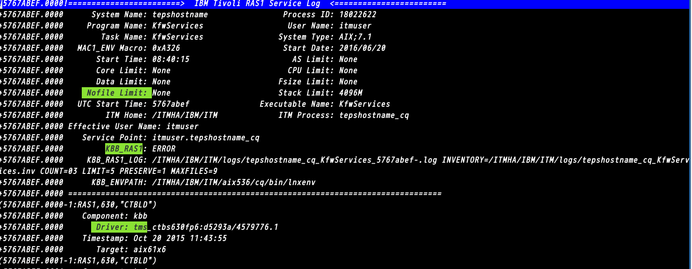

Running the Perl scripts against the ITM RAS logs  will extract configuration  information along with dknown errors.

While loading the raslog.vim in vim and viewing a RAS log will highlight configuration information and errors within the RAS log.

For instructions on automatically loading the raslog.vim syntax file,  view the header
information in the raslog.vim file.

Screenshot of ITM RAS log opended in VIM  using the raslog.vim syntax file.

